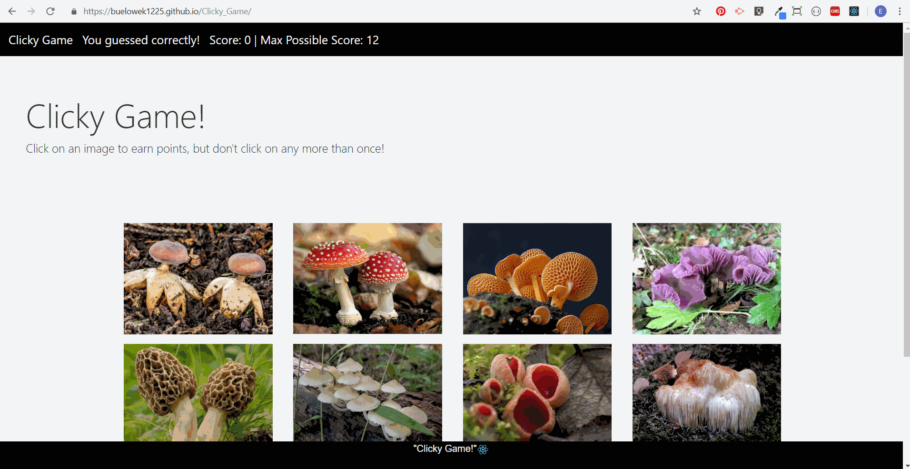

## Memory Clicky Game with React

**Project:** Clickly Memory Game with React

**Goal of this Project:** Create a memory game with React. This assignment will require you to break up your application's UI into components, manage component state, and response to user events. The web game has twelve (12) different images that the user/player can click on. Once the user clicks on an image the images are shuffled and user must remember which image/images they have already selected. The user gets one point for every new image they click until they get to seven (7), then they WIN! If they click an image they have already selected in a game they loose and the game restarts. 

**Created by:** Ellen Buelow

**Directions:** Lets test your memory! The 'Clicky Game' allows you to try and select seven(7) unique images in a row, but WATCH-OUT! Each time you select an image the game will shuffle the images around before you can select the next image. Each time you select the correct image you will get a point and if you select the wrong image you lose. Select carefully!

**Proof of functionality:**

    **Examples of Player gaming interactions:**
        **Ex 1 Player selects the same image twice:**
            Gif Example of player losing the game:
            
            
            
    **Example 2  Player selects 7 unique images and wins the game:**
            Gif Example of player winning:
            
